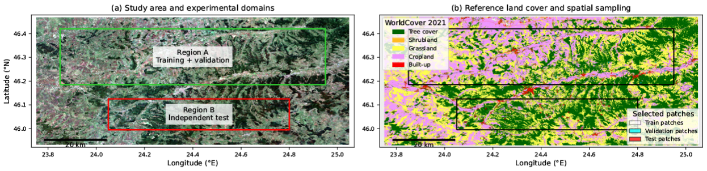
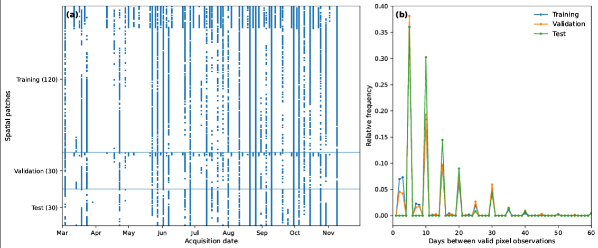
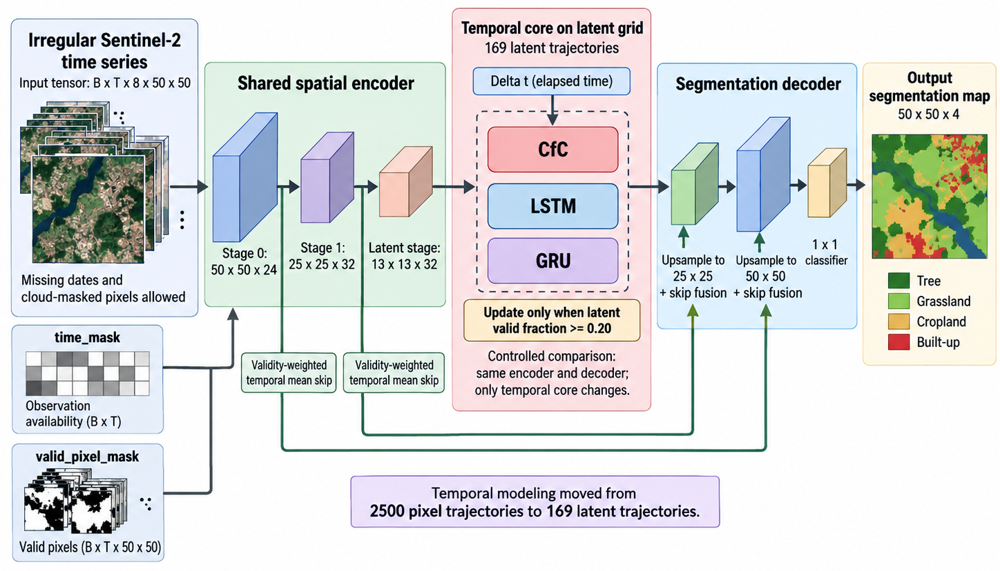
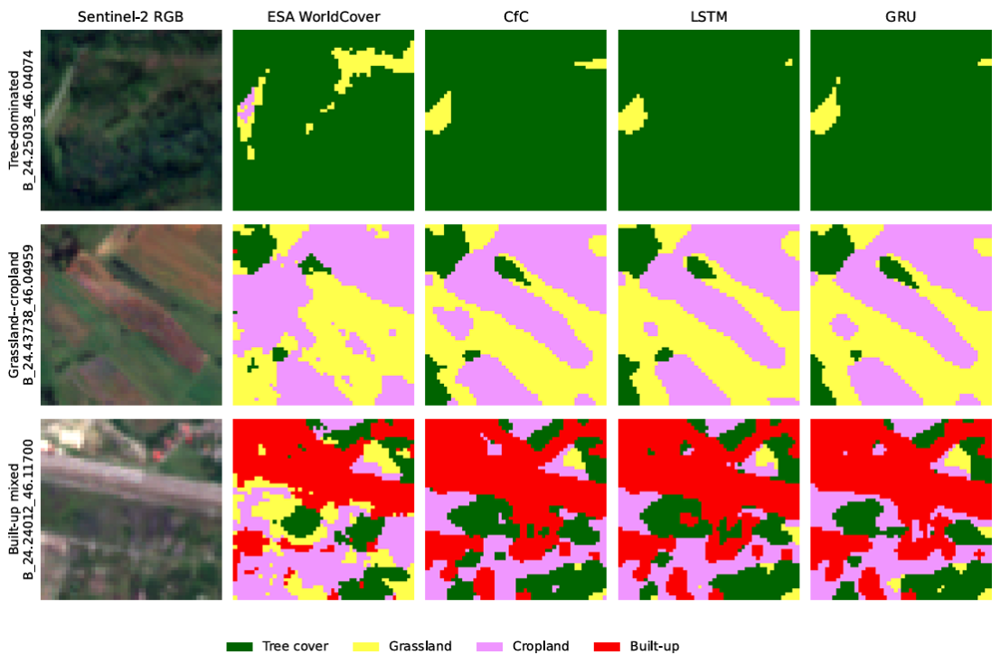
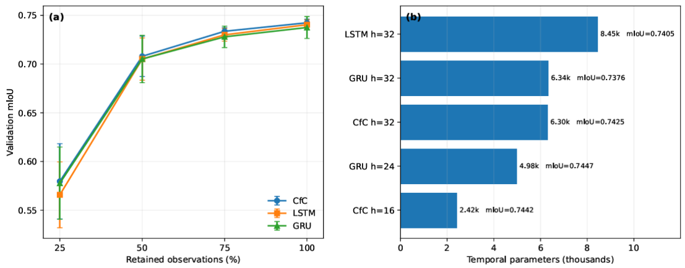

# Târnava Sentinel-2 LNN Dataset

This repository contains a compact dataset, processing code, figures, and experimental results for spatio-temporal land-cover segmentation in the Târnava Valley, Romania.

The experiment uses Sentinel-2 time series and ESA WorldCover labels to evaluate classical, recurrent, and continuous-time neural models, including CNN-CfC and CNN-LTC.

## Dataset

- Study area: Târnava Valley, Romania
- Satellite data: Sentinel-2
- Reference labels: ESA WorldCover 2021
- Main period: March–November 2023
- Temporal transfer: March–November 2024
- Patch size: 50 × 50 pixels
- Total patches: 180
  - 120 training
  - 30 validation
  - 30 independent test
- Classes: Tree cover, Grassland, Cropland, Built-up
- Features: B2, B3, B4, B8, B11, NDVI, NDWI, NDBI, NDMI

## Repository structure

```text
data/
  metadata/
  samples/

code/
  gee_export_tarnava_2023.js
  gee_export_tarnava_2024.js
  tarnava_50x50_data_process.py
  tarnava_50x50_models.py

figures/
  study_area.png
  temporal_irregularity.png
  latent_grid_architecture.png
  spatial_predictions.png
  robustness_efficiency.png

results/
  primary_model_comparison.csv
  controlled_cfc_lstm_gru_comparison.csv
  robustness_summary.csv
  temporal_transfer_2024.csv
  uncertainty_summary.csv
```

## Sample data

The repository includes a small example file: `data/samples/small_example_patch_timeseries.npz`

The full Sentinel-2 exports and full model-ready caches are not included because of file size.

## Models

The evaluated models include:

- Random Forest
- Temporal CNN
- CNN-GRU
- CNN-LSTM
- CNN-CfC
- CNN-LTC

In the controlled experiment, CNN-CfC obtained the best mean test performance and showed advantages in parameter efficiency, robustness to missing observations, uncertainty estimation, and temporal transfer from 2023 to 2024.

## Study area

Târnava Valley study area, spatial experimental split, ESA WorldCover labels, and selected 50 × 50 pixel Sentinel-2 patches.



## Temporal irregularity of Sentinel-2 observations

Temporal distribution and irregularity of the Sentinel-2 observations used in the experiment.



## Spatio-temporal model architecture

General architecture used for spatial feature extraction and temporal modelling with recurrent and continuous-time neural modules.



## Spatial prediction examples

Qualitative examples of land-cover predictions for selected Sentinel-2 test patches.



## Robustness and parameter efficiency

Robustness under reduced temporal observations and parameter-efficiency comparison between temporal models.


